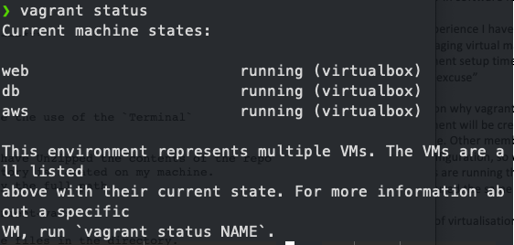

### How to get nodejs App up and running using Ansible

### Prerequisites
- `virtualBox` [download here](https://www.virtualbox.org/wiki/Downloads)
- `Vagrant` [download here](https://www.vagrantup.com/downloads)
- `Ansible` - This will be downloaded once inside the vm

## Files that needed for this to work
- ansible-playbooks
- app
- setup
- vagrantfile

## 1. Download the contents of the repo
- Download the contents of the this repo

## 2. Once in the directory with the vagrantfile
```bash
vagrant up
```

## 3. Vagrant status to verify the the vms that have been created
```bash
vagrant status
```



## 4. SSH into aws virtual machine
```bash
vagrant ssh aws
```

## 5. Installing Ansible on the Controller vm (aws)

```bash
sudo apt-get install software-properties-common -y

sudo apt-get update

sudo apt-get install software-properties-common

sudo apt-add-repository ppa:ansible/ansible

sudo apt-get update

sudo apt-get install ansible

sudo apt-get install tree
```

## 6. Setting up Ansible hosts with IP addresses

```bash
cd - so you are in the root of the controller

cd/etc/ansible

sudo su

nano hosts

copy and paste the following ensuring you comment out aws ip address

[web]
192.168.33.10 ansible_connection=ssh ansible_ssh_user=vagrant ansible_ssh_pass=vagrant

[db]
192.168.33.11 ansible_connection=ssh ansible_ssh_user=vagrant ansible_ssh_pass=vagrant

[aws]
192.168.33.12 ansible_connection=ssh ansible_ssh_user=vagrant ansible_ssh_pass=vagrant
```


## 7. Enter into the Web and db virtual machine

```bash
#go into web server

ssh vagrant@192.168.33.10

type vagrant

sudo apt-get update -y

sudo apt-get upgrade -y

exit

# do the same for db

#go into web server

ssh vagrant@192.168.33.11

type vagrant

sudo apt-get update -y

sudo apt-get upgrade -y

exit
```

## 8. Check connection with ansible ping

```bash
ansible all -m ping
```

## 9. Run the YAML file
```bash
cd /home/vagrant/ansible

syntax for running a .yaml file is ansible-playbook

run the ansible copy_app.yaml first

ansible-playbook copy_app.yaml

run the db playbook second

ansible-playbook db_playbook.yaml

lastly run test to automate the whole process

ansible-playbook test.yaml
```

## OR You can run the setup_script.sh script
```bash
cd /home/vagrant/setup

./setup_script.sh
```

## 10. Running the Nodejs app
```bash
https://192.168.33.10

https://192.168.33.10/fibonacci/7

https://192.168.33.10/posts
```
